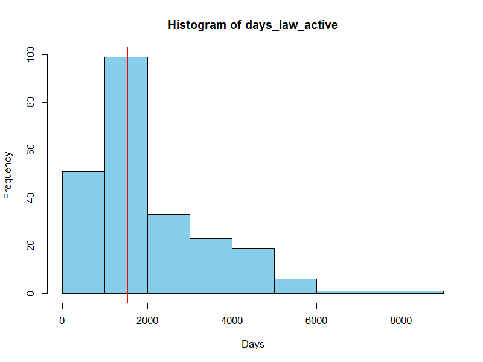
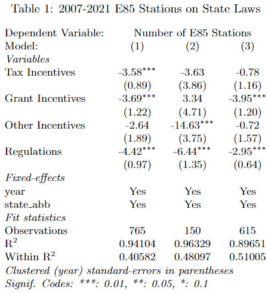

```{r setup, include=FALSE}
knitr::opts_chunk$set(echo = TRUE)

```

# Topic

What is the relationship between ethanol demand and state-level legislation?

# Motivation

Ethanol is a good source of clean energy. Incorporating it into gasoline allows for cleaner vehicle fuel sources. Ethanol is also produced domestically from domestically grown crops reducing U.S. dependence on foreign oil and increasing the nation's energy production. Therefore, ethanol not only promotes environmental responsibility but also strengthens the US nation's energy independence.

Since the 1990s, state and federal governments enacted more than 300 laws incentivizing the market for ethanol. In this study, we focus on the relationship between state-level legislation and ethanol. State-level legislation falls into four main categories: grant incentives, tax incentives, other incentives, and regulations. Most legislation is incentive based and many laws target increasing ethanol production and distribution infrastructure. While this study could look at federal legislation exclusively, focusing on state-level legislation will allow us to consider how differential policies to promote the ethanol market are related to differential changes in ethanol sales in individual states.

In order to investigate the relationship, we choose the number of E85 stations in each state as a proxy for ethanol sales. The term E85 specifically denotes a vehicle fuel blend containing 85% ethanol and 15% gasoline or other hydrocarbon, measured by volume. This blend represents the highest ethanol concentration commonly used in vehicles today. Other fuel blends, E10 and E15, can be run in most engine types. These fuel blends, requiring smaller shares of ethanol, are required by legislation whereas E85 is not required. Not all vehicles can use E85 fuel, so consumers purchasing E85 fuel make an active decision to operate a vehicle which can use E85 and then purchase E85 fuel. For these reasons, we assume the number of E85 stations approximates ethanol sale quantities more closely related to consumer demand. That being said, it is unclear whether increases in the number of E85 stations are driven purely by consumer demand or if state-level legislation played an active role in bolstering the market. Effectively, what came first -- increased ethanol sales or legislation?

Relationships between changes in E85 stations (ethanol sales) and legislation can be thought of in a number of different ways:

-   Legislation effectively increased the supply of E85 stations causing a supply shift.

-   E85 consumers lobbied for state-level legislation to incentivize an increased supply of E85 stations. Here, there may have been a change in quantity demand which the market was unable to respond to without legislative incentives (i.e. there were some barriers for ethanol producers to increase supply). In this scenario, there is a change in both supply and demand.

-   Changes in E85 stations are induced by other combinations of demand and supply shifts.

-   Changes in E85 stations are induced by demand shifts.

Ultimately, if we find a significant, positive relationship between the number of E85 stations and state-level legislation, we can infer the first scenario listed above is likely to be true. If we find that the relationship is more complex, additional research will be needed to further explain this relationship.

# Research Questions

The project aims to answer the following research questions:

1.  What is the distribution of E85 stations across all states and time? (Descriptive)

2.  How does total and kind of legislation change over time? (Descriptive)

3.  How is ethanol production related to corn production? (Descriptive)

4.  What is the distribution of E85 stations, legislation, and ethanol production across all states? (Descriptive)

5.  How might the number of E85 stations, legislation, ethanol production, and corn production be related across time? (Descriptive)

6.  What type of legislation is associated with greater increases in E85 stations? (Descriptive)

7.  Are state-level laws and ethanol production good predictors of ethanol sales? (Predictive)

Questions one through five will be answered in the Exploratory Analysis while questions six and seven are addressed in the Econometric Analysis.

# Exploratory Analysis

## Description of Data

For this project we use data from six main sources:

| Data Set Name                     | Variables                                                                          | Time Span | Geographical Coverage | URL                                                                                            |
|---------------|---------------|---------------|---------------|---------------|
| Ethanol Production                | Ethanol production in thousands of barrels per year                                | 1960-2021 | Nation-wide by state  | [Dataset 1](https://www.eia.gov/state/seds/seds-data-complete.php?sid=US##Production)          |
| Corn Production Volume            | Corn production in bushels by year                                                 | 1866-2023 | Nation-wide by state  | [Dataset 2](https://quickstats.nass.usda.gov/)                                                 |
| Corn Prices                       | Corn price received in USD/bushel by year                                          | 1867-2023 | Nation-wide by state  | [Dataset 3](https://quickstats.nass.usda.gov/)                                                 |
| E85 Stations                      | Number of available E85 station counts by state and year                           | 2007-2022 | Nation-wide by state  | [Dataset 4](https://afdc.energy.gov/stations/states)                                           |
| E85 Stations Laws and Regulations | Description of each law and regulation related to E85 fuel across states and years | 1990-2021 | Nation-wide by state  | [Dataset 5](https://afdc.energy.gov/data_download/)                                            |
| State Population                  | Population of each state                                                           | 2001-2022 | Nation-wide by state  | [Dataset 6](https://www.census.gov/data/tables/time-series/demo/popest/2020s-state-total.html) |

The data set on ethanol production is sourced from the US Energy Information Administration, while the data on corn production and corn prices are obtained from the United States Department of Agriculture. The data sets related to E85 are supplied by the US Department of Energy. The data set on state population was obtained from United States Census Bureau. The time-span we will cover is from 2007 to 2021.

The first four data sets in the table above and the population data set are organized such that every row corresponds to a specific state-year combination and include the relevant variables of interest. The legislation data is structured such that every row corresponds to individual legislation. It is modified so that the final data set contains "state-year" combinations of laws enacted in the specified year as well as active incentives and regulations in that year. All data sets are merged on "state-year" unique combinations. Each row in the final merged file corresponds to "state-year" combination and contains information on ethanol (in thousands of barrels), corn production (in bushels), corn prices in USD per bushel, population, number of E85 stations, number of enacted legislation, and number of active incentives and regulations.

## Data Processing

### Ethanol Production Data

The ethanol production was downloaded from the US Energy Information Administration as an Excel file. This data set includes information for many fuel sources in addition to ethanol. A codebook provided on the source website was used to determine filtering criteria for selecting only the ethanol production data. Needed variables were isolated and data was transformed from a wide to a long format to create a data frame organized in rows by state-year combinations. No transformations were applied. If a state reported some ethanol production data, missing values were interpolated within the state specific data. If the state never reported ethanol production, the missing values were replaced with zero. Some states did not have any ethanol production while other states have very large ethanol production. These large ethanol production values are not considered outliers because the values accurately describe that some states do have very high ethanol. These observations were left in the data set because it will allow us to explore questions like: Do states with high ethanol production have greater amounts of legislation?

### Corn Prices and Corn Production Data

An AIP request was used to pull both corn prices and corn production from the National Agricultural Statistical Service (NASS). Sometimes NASS will code suppressed or missing information as characters versus the expected numerical values. There was no suppressed information for either data set. Both datasets had missing information. If a state had some corn production or price information, missing data was populated using interpolation with the state specific data. If no corn production was ever reported, the missing values were replaced with zero. If corn price data was never reported for a state, the missing values were replaced with the national average for the year the data was missing. No values were considered extreme because, similar to the ethanol production data, high levels of corn production or corn prices include valuable information for this study. No transformations were applied.

### E85 Stations Data

Data set number 4 provides information on the number of E85 stations and total number of alternative fuel stations. It was sourced from the US Department of Energy Alternative Fuels Data Center. The data set is provided in the form of Excel file indicating the number alternative fuel stations per state. Each sheet in the file corresponds to a separate year.

To combine data on the number of E85 stations across years, we used a function that reads each sheet, creates a column "year" and fills it with the value of the name of the sheet. After that, columns of interest (state, year, E85 stations number and total number of alternative fuel stations) are selected and data is vertically combined for all years. The final processed file includes information on the number of E85 stations and total alternative fuel stations for each state across years 2007-2022.

### Ethanol-Related State-Level Legislation Data

This was sourced from the US Department of Energy Alternative Fuels Data Center. The data set contains ethanol related laws with a row for each law and many columns describing different attributes of the law.

We needed to transform this data set to the form of state-year-number of laws. A first challenge was that the data did not clearly define the start and end date for each law.

-   For the laws that were missing the end date, the status date was used as the end date. This is a consistent way to deal with missing values at the end date. The status date refers to the status update date, and it is usually updated when laws are expired (archived). Therefore, the status date is used as an approximation for missing end dates.

-   For the laws that were missing the start date (approximately 30% of observations), two approaches were used:

    1.  The first approach was to approximate the start date of the law with the earliest of either the significant update date or the amendment date. The rationale is that the modified law/regulation acts like a new law/regulation and therefore, the update date serves as the start date.
    2.  The second approach had to address that some data did not include an update or amendment date in addition to not including the start date. To approximate the start date, the end date minus the median number of days all laws in the data set stayed active was calculated. This approach is justified because the number of days all laws stay active follows a distribution very similar to a normal distribution. See the histogram below.

-   The data set also includes characteristics of each law: whether it is regulation or incentive and which type of incentive it is. We generated dummy variables to indicate whether a law falls under the category of regulation, grant incentive, tax incentive, or other inventive.

-   Next, we expanded the data set so each row represented a separate law, state, year when it was active, law type indicators, and indicators for law was first enacted in that year. If the start date of the law was after June, we count the first active year as the next year as we assume that it takes time for the law to fully come into force.

-   Last, we organized the dataset by state and year, aggregating the dummy variables. Consequently, the refined data frame on legislation took shape, where each row represents a state-year combination describing the count of laws enacted and additional variables noting the total count of laws divided into type-categories for the given year and state.

{style="display: block; margin: 1em auto" width="600"}

### Population State-Level Data

The state-level population data was downloaded from the US Census Bureau as Excel files for three time periods: 2000-2010, 2010-2020, and 2020-2021. Each file included data on each state and population values for corresponding years. Data sets were pivoted from wide to long format for each row to represent a state-year combination, with the corresponding population values.

There were no missing values. Population data was merged with other data sets on state-year combination. The data is used to account for different population sizes in different states in the econometric analysis stage of the project.

## Finding 1: *Number of E85 stations gradually increased between 2007 and 2021. Corn belt states, Texas and California are leaders in number of E85 stations.*

{style="display: block; margin: 1em auto" width="600"}

These first two graphs show the number of E85 stations between 2007 and 2021 for (1) the top 10 states with the highest number of stations as well as (2) the trend in total US E85 gas stations. . In the first graph, we also include the average for the remaining states in dark blue which represent a proportionally small share of E85 stations as compared to the top ten states. Dotted vertical lines indicate the enactment of federal-level laws. We see that the overall number of E85 stations grow over time for all states with the absolute leader being Minnesota. Between 2007 and 2021, the total count of E85 stations in the country more than doubled. Interestingly, it is apparent that, with the exception of the federal law implemented in 2020, it is not obvious that federal-level legislation had a strong impact on the number of E85 gas stations at the aggregate or state level. Instead, the rise in E85 stations was the result of individual growth across all states, underscoring the influence of aggregate expansion rather than the direct effect of federal laws.

{style="display: block; margin: 1em auto" width="600"}

This third graphic is composed of three maps showing the distribution of E85 stations across the US in 2007, 2014 and 2021. The darker shades correspond to a higher number of E85 stations. We see gradual increase in E85 station number across states with the corn belt states having the highest number of E85 along with Texas and California.

## Finding 2: *Ethanol related legislation experienced a wave of popularity which began crashing in 2013.*

{style="display: block; margin: 1em auto" width="600"}

At the beginning of our time period of interest, there was a significant increase in active legislation relating to ethanol. Today, most of that legislation has been repealed or is no longer active. This allows us to infer two things. First, ethanol-related legislation in the form of grants or incentives may have allowed for capital investments in ethanol production and distribution which would have effects on the number of E85 stations and ethanol demand. The effects of this legislation may still persist while the actual legislation has expired or been repealed. Improvements to infrastructure do not need to be funded on a perpetual basis. Second, there may be a reduction in ethanol related legislation because the legislation was repealed due to it no longer being valued or because it was considered ineffective. This would imply that the legislation had no impact on the number of E85 stations.

## Finding 3: *States which produce a lot of corn also produce a lot of ethanol.*

{style="display: block; margin: 1em auto" width="600"}

Ethanol production is clearly higher in states which have larger corn production. States with high corn and ethanol production include Iowa, Missouri, and Illinois. This implies that much of the ethanol produced in the United States is produced in states which also produce a lot of corn - likely due to market effects incentivizing minimization of transportation costs. Corn production and ethanol production are not particularly variable across years. All data points of the same color represent corn and ethanol production of a given state. Each point represents a unique year, though. One of the things we can infer from this is that capital investments must be sufficiently large to require the supply of ethanol and corn production to be relatively stable within a state.

## Finding 4: *States with less legislation tend to have fewer E85 stations.*

{style="display: block; margin: 1em auto" width="600"}

This first (left) map illustrates the distribution of E85 stations in 2021. The central map demonstrates the distribution of total enacted E85-related laws in 2021, while the the third (right) map shows the distribution of total ethanol production in thousands of barrels in 2021.In each of the maps, darker shades correspond to a larger values of each of the variables of interest.

From the first two maps, the pattern reveals that states with fewer legislation enacted in that year (ranging from 0 to 2) tend to have fewer E85 stations. However, the relationship becomes less clear in states with higher numbers of incentives and regulations. For instance, both Nevada and California have enacted 3 laws, yet the number of E85 stations in these states varies significantly.

From the second and the third maps, we do not see a clear relationship between the number of E85 stations and ethanol produced. States like Iowa and Illinois which produce large volument of ethanol have significantly different numbers of E85 stations available.

## Finding 5: *Increases in the number of E85 stations followed large increases in ethanol related legislation.*

{style="display: block; margin: 1em auto" width="600"}

Through this graphic, we are able to identify that the total number of E85 gas stations in the United States increased following significant increases in the number of active state-level legislation in the United States. We can see that corn production does not vary significantly (ethanol related legislation is likely not affecting the amount of corn produced), but ethanol production does increase as active ethanol related legislation increases. Ethanol related legislation is associated with increases in ethanol production and E85 demand implying that legislation helped bolster the market for ethanol.

# Econometric Analysis

## Motivation

To clearly parse out the relationship between ethanol sales (E85 gas stations) and state-level legislation, we will use two kinds of econometric analysis to address the following questions:

-   What type of legislation is associated with greater increases in E85 stations?

-   Are state-level laws and ethanol production good predictors of ethanol sales?

The first question will be approached with a descriptive model. The second question will be addressed using predictive modeling, specifically a Lasso regression. While our first question naturally lends itself to being causal, this project did not work to address causal identifying assumptions. So, for this analysis a descriptive only interpretation is appropriate. An analysis approach which incorporated data appropriate for a difference-in-difference model or event study would be most appropriate for describing causal relationships.

Even before 2007 when our study time frame begins, there were large increases in state-level legislation to promote the ethanol market. But, the performance of this legislation is largely untested. Our first model will help determine if legislation is associated with increases in the number of E85 stations and if the degree of increase depends on the kind of legislation implemented. Identifying the effectiveness of different kinds of legislation is critical to informing the priorities of future legislation. As the United States continues to search for alternative fuel sources to increase environmental responsibility and reduce energy dependence, additional legislation may need to be considered to promote further development of the ethanol market.

Our second model helps inform which covariates may be important for other econometric analysis. Our descriptive and predictive models were developed independently but future research may use results from the predictive analysis to determine how to improve upon the descriptive model. Better descriptive models will help to more clearly define any possible causal relationships and better policy decisions.

## Methods

### Descriptive Analysis

A linear model with state-year fixed effects was used to regress the number of E85 stations (e85) on active legislation count. Active legislation is divided into the following subcategories: tax incentives (tax), grant incentives (grant), other incentives (other), and regulations (reg). Control variables (omega) include the total number of alternative fuel stations, ethanol production, corn production, corn prices, and population. These control variables account for factors which vary within state and across time and that will not be controlled for with fixed effects. Note, i and t denote the factors by which each variable varies.

Models 1-3:

$$ e85_{it} = \beta_0 + \beta_1*tax_{it} + \beta_2*grant_{it} + \beta_3*other_{it} + \beta_4*reg_{it} + \beta_n*\omega_{it} + e_{it} $$

Ultimately, three additional models were developed. The same model as above was applied to two data subsets. Data for model two includes only the states with the top ten ethanol production. The model three data set includes all states but those included in the top ten for ethanol production. This will provide valuable information because it will allow us to determine if our results are driven by states that already have a well-developed ethanol market or if the results apply to other states as well.

The fourth model can be described as follows:

$$ e85_{it} = \beta_0 + \beta_1*inc_{it} + \beta_2*inc1_{it} + \beta_3*inc2_{it} + \beta_4*inc3_{it} + \beta_5*reg_{it} + \beta_6*reg1_{it} + \beta_7*reg2_{it} + \beta_8*reg3_{it} + \beta_n*\omega_{it} + e_{it} $$

This model regresses E85 gas stations on all incentives (inc) and regulations (reg). This model varies from the first model because it includes lagged variables of one, two, and three degrees for incentives and regulations. This model allows us to consider if the effects of legislation are not observed immediately and when those effects because the greatest.

### Predictive analysis

To consider the most effective covariates, we use the Lasso regression model. The rationale behind opting for Lasso lies in its inherent ability to assign certain coefficients to zero. This feature proves advantageous as it facilitates the selection of relevant features for subsequent research.

For predictive analysis, the target of prediction is number of E85 stations and other variables serve as predictors. The predictor variables were transformed the following way:

-   Dummy variables were created for the "year" variable.

-   The variables "total_stations" and "population" were log transformed due to their initial distribution

-   All variables were normalized.

-   Interaction variables between all predictors were created.

-   Predictors with next-to zero variation and 0.9 correlation were removed.

The model was trained on 80% of the data set. To address the fact that we are working with panel data clustered in state groups, group_initial_split command was used to split the data. The tuning parameter is $\lambda$ which controls shrinkage. A larger value of $\lambda$ results in stronger regularization, leading to more coefficients being pushed towards zero. On the other hand, a smaller value of $\lambda$ reduces the strength of regularization, allowing the model to fit the training data more closely. Overall, the value of $\lambda$ determines the regularization scale to prevent the model from overfitting by penalizing large coefficient values. For the tuning process in the model, we used five-fold cross validation accounting for the dependence of all observations for each state. This was done using the group_vfold_cv() command from rsample.

## Results

### Descriptive Analysis

This first table presents results for models 1-3. Column one corresponds to the model with all data. Column two corresponds to the model with only the top ten ethanol producing states. Column three corresponds to the model with all states except those who are top ten for producing ethanol. Note covariates were included in the models but the results are not included in Table 1.

{style="display: block; margin: 1em auto" width="400"}

Ultimately, our results are inconsistently significant and describe the exact opposite of the effect we were hoping to observe. All results reported in the table can be interpreted similarly to as follows: increasing the number of tax incentives by one is associated to a 3.58 decrease in the number of E85 stations holding all else constant. Contextualizing these results blindly, we would infer that all classes of state-level laws have a negative relationship with the number of E85 gas stations.

{style="display: block; margin: 1em auto" width="600"}

Table 2 reports results for model 4 which includes the lagged legislation variables.  Covariates were included in the model, but results are not included in this table.  The incentive and regulation only variables can be interpreted the same as those for models 1-3.  Lagged variables can be interpreted similar to as follows: a one unit increase in legislation active in the year prior is associated with a 1.84 decrease in the number of E85 stations.

Similar to models 1-3, we could blindly interpret these results as if all classes of legislation are related to decreases in E85 stations. It is more likely, though, that our methodology has fundamental flaws which prevent us from observing positive relationships.  Additional model refinement would help us determine if state-level legislation does have a negative impact on the number of E85 stations, if legislation has no impact, or if some or all classes of legislation have a positive impact on E85 stations as we expected.  Ultimately, because these results do not align with theory presented in this analysis and we have not pursued additional model refinement, we cannot infer any information to address our research question.  Additional model refinement may include considering omitted variables, addressing any potential reverse causality, and utilizing a difference-in-difference or event study approach.

### Predictive Analysis

We report the results for the best performing Lasso model. To determine the best performing model, we use using root mean squared error (RMSE) which we opt for not only due to its prevalence as a common metric but also because of its ease of interpretation. The best-performing model yields an RMSE of 139 on the test set with the penalty being 1.87. These metrics are not particularly impressive, but it is important to reiterate that the purpose of our predicting analysis is in selecting relevant features rather than obtaining the most accurate prediction model. The predicted versus actual values are presented in the plot below. We see that the model does best in predicting values of E85 stations larger than 0 due to large variations in predictors for observations with zero E85 stations. {style="display: block; margin: 1em auto" width="600"}

The main finding of our predictive analysis is identifying variables with the greatest predictive power. Out of 208 predictors, the lasso model identified 18 predictors with non-zero coefficients. We subdivide non-zero coefficients into the three groups: primary variables, interaction terms with primary variables and interaction terms with year dummy variables. We believe that the first two groups would be the most beneficial for covariates selection in the further causal inference studies as the terms interacted on year have little inferential importance.

**Non-zero coefficients: Primary variables**

|      Term       |  Estimate   | Penalty  |
|:---------------:|:-----------:|:--------:|
| corn.production | 39.26098654 | 1.876175 |
|   population    | 18.90899353 | 1.876175 |
| total_stations  | 15.49756535 | 1.876175 |
| eth.production  | 7.42780665  | 1.876175 |
|   regulations   | 3.60694128  | 1.876175 |

**Non-zero coefficients: Interaction terms with primary variables**

|               Term               |  Estimate   | Penalty  |
|:--------------------------------:|:-----------:|:--------:|
|   eth.production_x_population    | 32.4325463  | 1.876175 |
| total_stations_x_corn.production | 15.33489842 | 1.876175 |
|  regulations_x_corn.production   | 6.74409047  | 1.876175 |
|   total_stations_x_population    | 4.97338697  | 1.876175 |

**Non-zero coefficients: interaction terms with year dummy variables**

|             Term              |  Estimate  | Penalty  |
|:-----------------------------:|:----------:|:--------:|
|    population_x_year_X2021    | 9.84841767 | 1.876175 |
|    population_x_year_X2020    | 8.60993215 | 1.876175 |
|  total_stations_x_year_X2021  | 7.84033431 | 1.876175 |
|    population_x_year_X2019    | 5.97738847 | 1.876175 |
| grant_incentives_x_year_X2019 | 5.01497532 | 1.876175 |
|    population_x_year_X2018    | 3.25035857 | 1.876175 |
|  total_stations_x_year_X2020  | 2.84301975 | 1.876175 |
|  eth.production_x_year_X2012  | 0.2850217  | 1.876175 |
|  eth.production_x_year_X2018  | 0.06314095 | 1.876175 |

From the table above, we can answer our research question "Are state-level laws and ethanol production good predictors of ethanol sales?." We conclude that ethanol production and state-level regulations are good predictors of the number of E85 stations and one should use them in further causal inference analysis. It is interesting to note that not all legislation was a good predictor - no incentive-based law types were identified as good precitors.

# AI Disclosure

ChatGPT was used as a resource to troubleshoot coding issues and proofread writing.
